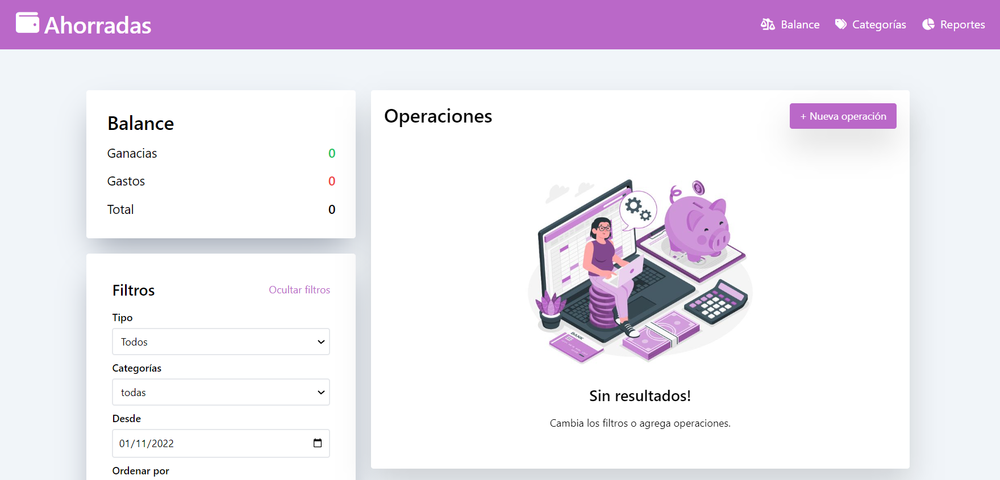

# Bienvenidos a nuestro proyecto Ahorradas! 📊

**Te invitamos a visitarnos haciendo click [aqui][]! **

## Introducción ## 📌
***

Ahorradas es el segundo proyecto correspondiente al módulo de JavaScript en el curso de front end dictado por adaITW! Ahorradas es un controlador de gastos, en el cual el usuario podrá registrar todas sus operaciones tanto ingresos como egresos, ver un balance de los mismos, filtrar la información que necesita, crear categorías específicas según sus necesidades y un reporte general de sus actividades en base a el total de sus movimientos. 

Hasta el momento es el proyecto más grande en el que trabajamos, nuestra primera experiencia trabajando en equipo; durante el trayecto nos encontramos con muchos desafíos, y cosas por aprender, pusimos muchas ganas para poder llegar a este punto de nuestro desarrollo como futuras programadoras front-end!

## Desarrollo ## 📌
***

- HTML5 como base del proyecto y maquetado
- JAVASCRIPT desarrollo lógico y funcional
- TAILWIND estilado 
- GITHUB herramienta para trabajar en conjunto

## Funcionalidades ## ⚙️
***

Este proyecto cuenta con tres secciones centrales, a las mismas se puede acceder desde el nav, las mismas son:

- Balance
- Categorías 
- Reportes

### Balance ### 📌

Aquí  contamos con tres sub secciones:
- Operaciones
- Balance
- Filtros

La sección de Operaciones, donde se pueden registrar nuevas operaciones, las mismas trabajan sobre un array de objetos alojado en localStorage, de forma tal que el usuario mantenga un registro de sus interacciones incluso cuando cierre el navegador y lo vuelva a abrir; Las operaciones ya registradas cuentan con la posibilidad de ser editadas y eliminadas. Esta sección en el caso de no registrar operaciones muestra una imagen. La sección de Balance, donde se muestran el acumulado de ganancias, y de gastos así como también el cálculo de la diferencia entres estas dos; Aquí trabajamos con un ciclo for of para filtrar y devolver los valores deseados. La sección de Filtros donde se selecciona lo que se necesita visualizar en la pantalla principal, contamos con filtros de tipo, categoría, y fecha; Aquí se cuenta con la opción de ordenar alfabéticamente, por monto y por antigüedad.

 
### Categorías ### 📌

La sección de Categorías cuenta con la posibilidad de agregar nuevas categorías, editar las pre existentes y eliminarlas, al igual que en Operaciones trabajamos con un array de objetos almacenado sobre localStorage

### Reportes ### 📌

La sección de reportes es un resumen de todos los movimientos realizados sobre la cuenta, tenemos resúmenes, totales por categoría y totales por mes.

*Gracias por llegar hasta acá y espero que lo disfruten!* 😊

Desarrollado con 💜 por Lourdes Correa y Lucia Martinez 